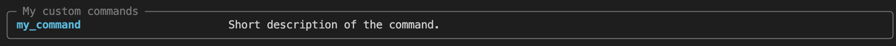
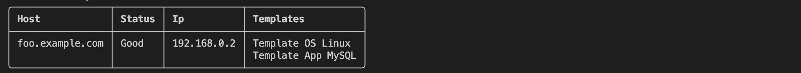
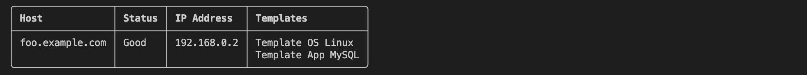

# Writing plugins

This guide goes over everything required to write a local plugin loaded by the application on startup.

## Basics

### Directory structure

Start off by creating a new directory containing a Python module that defines the plugin, as well as an `__init__.py` file:

```plaintext
.
└── my_plugin/
    ├── __init__.py
    └── plugin.py
```

The `__init__.py` file can be empty, but it's a good practice to define one for Python to treat the directory as a package. The `plugin.py` file is where the plugin's functionality is defined. Defining your plugin as a package lets you split your plugin into multiple files, making it easier to manage as it grows in complexity. It also allows you to more easily publish the plugin as an external package later on should you choose to do so.

### Module

In order to define new commands in our plugin module, we need to import `zabbix_cli.app.app`. This is the main Typer application object that we will use to access the application state and define new commands with. A simple command that prints a message to the console can be defined like this:

```python
# /path/to/my_plugin/plugin.py
from zabbix_cli.app import app

@app.command(name="my_command")
def my_command() -> None:
    print("Hello, world!")
```

### Activating the plugin

We will look at plugin configuration more in-depth in the [Configuration](#configuration) section, but for now, we can add the plugin to the configuration file like this:

```toml
[plugins.my_plugin]
module = "/path/to/my_plugin/my_plugin.py"
```

This tells the application to load the plugin module when it starts up.

Running `zabbix-cli --help` should now show the new command in the list of available commands.

<figure markdown="span">
  { width="100%" }
  <figcaption>The command from the plugin is loaded</figcaption>
</figure>

However, we can see that the command does not have a description or belong to any particular category. In the next section we will look at adding help text to commands and defining a category.

### Help text and categories

Commands can have a long and short description and belong to a category. The category is used to group commands in the help output. We can define a category for our plugin commands by providing an argument to the `rich_help_panel` parameter when defining the command. This will add a new section to the help output with the given name we chose.

```python
RICH_HELP_PANEL = "My custom commands"

@app.command(name="my_command", rich_help_panel=RICH_HELP_PANEL)
def my_command() -> None:
    """Short description of the command.

    Longer description going over the command in more detail.
    """
    print("Hello, world!")
```

The command will now be added to its own category in the help output:

<figure markdown="span">
  { width="100%" }
</figure>

Invoking `zabbix-cli my_command --help` shows the long description we provided:

<figure markdown="span">
  { width="100%" }
</figure>

### Printing messages

One of the most common operations in a CLI is printing messages to the console. The application provides several convience methods for printing messages to the console with specific formatting, which we can use in our commands to print messages consistent with the rest of the application. These are:

- `zabbix_cli.output.console.success`
- `zabbix_cli.output.console.info`
- `zabbix_cli.output.console.warning`
- `zabbix_cli.output.console.error`

As well as [Rich](https://rich.readthedocs.io/en/latest/introduction.html) Console objects for stdout and stderr for more advanced formatting:

- `zabbix_cli.output.console.console`
- `zabbix_cli.output.console.err_console`

We can use these to print to the console like this:

```python
from zabbix_cli.app import app
from zabbix_cli.output.console import success
from zabbix_cli.output.console import info
from zabbix_cli.output.console import warning
from zabbix_cli.output.console import error
from zabbix_cli.output.console import err_console
from zabbix_cli.output.console import console


@app.command(name="my_command")
def my_command() -> None:
    success("Success message")
    info("Info message")
    warning("Warning message")
    error("Error message")
    err_console.print("Error message")
    console.print("Output of some sort")
```

This will print messages to the console using the same formatting as the built-in commands:

<figure markdown="span">
  { width="100%" }
</figure>

### Command arguments

In general, it is best to refer to the [Typer](https://typer.tiangolo.com/tutorial/) documentation when it comes to defining command arguments. However, a minimal example is provided here, showing how to define a command with a positional argument and a named option and use them to interact with the Zabbix API client:

```python
from typing import Optional

import typer
from zabbix_cli.app import app
from zabbix_cli.render import render_result

# Define a new command
@app.command(name="my_command")
def my_command(
    arg1: str = typer.Argument(help="Some positional argument"),
    opt1: Optional[str] = typer.Option(None, "--opt1", "-O", help="Some named option"),
) -> None:
    """Short description of the command."""
    # We can use the Zabbix API client
    host = app.state.client.get_host(arg1)

    # We can use the same rendering machinery as the built-in commands
    render_result(host)
```

### Post-import configuration

The module can define a function called `__configure__` that will be called after the application has finished its own configuration. This function can be used to perform any necessary setup or configuration that the plugin requires. The function takes a single `PluginConfig` argument.

```python
from zabbix_cli.app import app
import logging

logger = logging.getLogger(__name__)

def __configure__(config: PluginConfig) -> None:
    logger.info(f"Running post-import configuration for {config.module}")

    # We can access anything we need from the application state as long as the plugin module imports `zabbix_cli.app.app`

    # Set custom HTTP headers
    app.state.client.session.headers["X-Plugin-Header"] = "Some value"

    # Ensure that a certain configuration key is set
    app.state.config.api.legacy_json_format = False
```

You are free to perform any configuration you want in the `__configure__` function. However, be aware that modifying certain config options, especially those found in `app.state.config.api`, will not have any effect on the rest of the application. By the time `__configure__` is called, the application has already configured the API client.

### Configuration file

Plugins are configured in the application's configuration file. Given that we have a plugin named `my_plugin`, its configuration file entry should look like this:

```toml
[plugins.my_plugin]
```

Depending on whether you are writing a local or external plugin, the configuration requires different options. External plugins do not require _any_ configuration by default, while local plugins _must_ have a `module` key defined.

#### `module`

Local plugins must define this key. Its value can be a module path or a a file path. If using a file path, it is highly recommended to use an absolute path.

```toml
[plugins.my_plugin]
module = "/path/to/my_plugin/my_plugin.py"
# OR
# module = "path.to.my_plugin"
```

#### `enabled`

Enable or disable plugin. Plugins are enabled by default unless otherwise specified.

```toml
[plugins.my_plugin]
enabled = false
```

#### `optional`

Mark a plugin as optional, meaning the application will not exit if the plugin module cannot be imported. This is useful for plugins that are not required for the application to function. Plugins are not optional by default.

```toml
[plugins.my_plugin]
optional = true
```

#### Extra options

The plugin configuration can contain any number of extra options that the plugin module can access. These options can be accessed through the `PluginConfig` object that is passed to the `__configure__` function.

```toml
[plugins.my_plugin]
module = "path.to.my_plugin"
extra_option_str = "foo"
extra_option_int = 42
extra_option_list = ["a", "b", "c"]
```

The `PluginConfig.get()` method can be used to retrieve the value of these extra options. The method takes the key of the option as the first argument, and an optional default value as the second argument. The method also takes an optional type hint as the third argument `type`.

```python
from zabbix_cli.app import app
from zabbix_cli.config.model import PluginConfig


def __configure__(config: PluginConfig) -> None:
    # Access extra options
    opt1 = config.get("extra_option_str")

    # Validate the type of the option
    # Also lets type checkers know the type of the variable
    opt1 = config.get("extra_option_str", type=str)

    # Types are optional
    opt2 = config.get("extra_option_int")
    # reveal_type(opt2) # reveals Any because no type hint
    # Types from the TOML file are preserved
    assert isinstance(opt2, int)

    # We can validate more complex types too
    opt4 = config.get("extra_option_list", type=list[str])
    # reveal_type(opt4) # reveals list[str]

    # We can also provide a default value
    opt4 = config.get("non_existent_option", "default")
    assert opt4 == "default"

    # Type hints are supported here too
    opt5 = config.get("non_existent_option", "default", type=str)
    # reveal_type(opt5) # reveals str
    assert opt5 == "default"

    # Use our config options:
    app.state.client.session.headers["X-Plugin-Header"] = config.get(
        "extra_option_str", type=str
    )
```

!!! tip
    Providing a type for the `get()` method will also give you better auto completion and type checking in your editor.

### Accessing plugin configuration from commands

Inside commands, the plugin's configuration can be accessed through the `app.get_plugin_config()` method.

The name of the plugin, as denoted by its `[plugins.<name>]` key, is passed as the argument to the method. If no configuration can be found, an empty `PluginConfig` object is returned.

Given the following configuration:

```toml
[plugins.my_plugin]
```

We can access its configuration like this:

```python
from zabbix_cli.app import app


@app.command()
def my_command() -> None:
    config = app.get_plugin_config("my_plugin")
```

!!! note
    Should no config be available, an empty `PluginConfig` is returned. This is to facilitate external plugins that do not _require_ a configuration to be defined.

## Advanced

### Rendering

Most zabbix-cli commands render a table or JSON depdening on the active output format. The functionality that powers this is the `zabbix_cli.models.TableRenderable` class. This class is a Pydantic model that can be subclassed and used to define data models that the application can render.

```python
from typing import List

from zabbix_cli.models import TableRenderable
from zabbix_cli.output.render import render_result


class MyModel(TableRenderable):
    host: str
    status: str
    ip: str
    templates: List[str]


@app.command(name="my_command")
def my_command() -> None:
    m = MyModel(
        host="foo.example.com",
        status="Good",
        ip="192.168.0.2",
        templates=["Template OS Linux", "Template App MySQL"],
    )
    render_result(m)
```

Invoking the command will render the model as a table:

```bash
zabbix-cli my_command
```

{ width="75%" }

Adding `-o json` will render the model as JSON:

```bash
zabbix-cli -o json my_command
```

```json
{
  "message": "",
  "errors": [],
  "return_code": "Done",
  "result": {
    "host": "foo.example.com",
    "status": "Good",
    "ip": "192.168.0.2",
    "templates": [
      "Template OS Linux",
      "Template App MySQL"
    ]
  }
}
```

### Field-level customization

By default, column headers and cells are determined by the field names and values of the model. We can customize this behavior by adding metadata to the model fields using something called "Meta Keys". These are special keys that can be added to the `json_schema_extra` dict of a field to change how it is rendered.

#### Column headers

If we just want to change the column header for a single field, we can pass a `zabbix_cli.models.MetaKey` object to the field's `json_schema_extra` dict when defining it:

```python
from pydantic import Field
from zabbix_cli.models import MetaKey
from zabbix_cli.models import TableRenderable


class MyModel(TableRenderable):
    host: str
    status: str
    ip: str = Field(..., json_schema_extra={MetaKey.HEADER: "IP Address"})
    templates: List[str]
```

This will change the column header for the `ip` field to "IP Address":

{ width="75%" }

#### Lists

Lists are rendered as newline-separated strings by default. We can change this by passing a `zabbix_cli.models.MetaKey` object to the field's `json_schema_extra` dict with the `MetaKey.JOIN_CHAR` key set to the desired separator:

```python
from pydantic import Field
from zabbix_cli.models import MetaKey
from zabbix_cli.models import TableRenderable

class MyModel(TableRenderable):
    host: str
    status: str
    ip: str
    templates: List[str] = Field(..., json_schema_extra={MetaKey.JOIN_CHAR: ", "})
```

This will render the `templates` field as a comma-separated string:

{ width="75%" }

## Example

A complete example of a plugin that defines a new command and uses the plugin configuration to set a custom HTTP header on the Zabbix API client:

```python
# /path/to/my_plugin.py
from __future__ import annotations

from typing import Optional

import typer
from zabbix_cli.app import app
from zabbix_cli.render import render_result

# Header for the rich help panel shown in the --help output
CATEGORY = "My custom commands"

def __configure__(config: PluginConfig) -> None:
    app.state.client.session.headers["X-Plugin-Header"] = config.get("extra_option_str", type=str)


@app.command(name="my_command", rich_help_panel=CATEGORY)
def my_command(
    arg1: str = typer.Argument(help="Some positional argument"),
    opt1: Optional[str] = typer.Option(None, "--opt1", "-O", help="Some named option"),
) -> None:
    """Short description of the command."""
    host = app.state.client.get_host(arg1)
    render_result(host)
```

And the corresponding configuration:

```toml
[plugins.my_plugin]
module = "path.to.my_plugin"
enabled = true
optional = false
extra_option_str = "foo"
```

An example of an external plugin with several commands, tests, and a `pyproject.toml` file can be found here: <https://github.com/pederhan/zabbix-cli-plugin-entrypoint>

## Performance

The application at large makes use of inline imports inside functions to improve the startup time of the application. For the most part, the modules that are most the important to lazily import are ones that define Pydantic models. In order of performance impact, they are:

1. `zabbix_cli.pyzabbix.types`
2. `zabbix_cli.pyzabbix.models`
3. `zabbix_cli.commands.results`

### Inline imports

Consider creating a separate module for your own models that you can import inside your commands that need them. This will prevent a cascade of imports that can add several hundred milliseconds of startup time to the application. Pydantic is notoriously slow at defining models, so avoiding importing these modules until they are needed is crucial.

**BEFORE**

```python
# /path/to/my_plugin.py
import typer
from zabbix_cli.app import app
from zabbix_cli.models import TableRenderable
from zabbix_cli.output.render import render_result
from zabbix_cli.pyzabbix.types import Host


class MyModel(TableRenderable):
    host: Host


@app.command(name="my_command")
def my_command(ctx: typer.Context, name: str = typer.Argument()) -> None:
    host = app.state.client.get_host(name)
    model = MyModel(host=host, foo="foo", bar=42)
    render_result(model)

```

**AFTER**

```python
# /path/to/models.py

from zabbix_cli.models import TableRenderable
from zabbix_cli.pyzabbix.types import Host

class MyModel(TableRenderable):
    host: Host
    foo: str
    bar: int

# /path/to/plugin.py
import typer
from zabbix_cli.app import app
from zabbix_cli.output.render import render_result


@app.command(name="my_command")
def my_command(ctx: typer.Context, name: str = typer.Argument()) -> None:
    from .models import MyModel # or use absolute import
    host = app.state.client.get_host(name)
    model = MyModel(host=host, foo="foo", bar=42)
    render_result(model)
```

### Profiling

!!! warning
    `py-spy` does not support Python 3.12 at the time of writing.

Consider using [`py-spy`](https://github.com/benfred/py-spy) to profile the application before you package and distribute your plugin to ensure that it does not have a significant impact on the application's startup time. Profiling `--help` lets us profile the application startup time before any network I/O can occur.

Install `py-spy` with:

```bash
pip install py-spy
```

We can then use `py-spy` to profile the different imports the application performs and generate an SVG file:

```bash
sudo py-spy record --subprocesses -o profile.svg --format speedscope -- zabbix-cli --help
```

The generated SVG file can be viewed on its own, or uploaded to the [speedscope](https://www.speedscope.app/) web application for a more interactive experience.

<figure markdown="span">
  { width="100%" }
  <figcaption>Visual profiling with speedscope</figcaption>
</figure>

The width of a bar indicates the time in milliseconds the given import adds, while its height indicates the number of stack frames generated as a result. A wide bar indicates a slow import, and can often be traced back to a cascade of numerous dependent imports and/or specific time-consuming imports.
